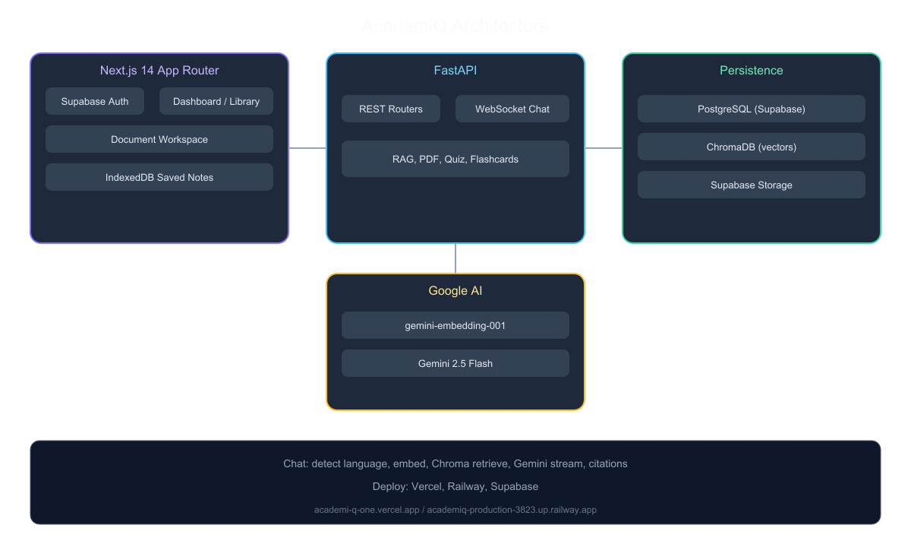
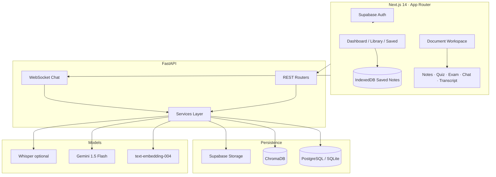

# AcademiQ

**🚀 Live Demo: https://academi-q-one.vercel.app**

**API: https://academiq-production-3823.up.railway.app/docs**

**A production-style, bilingual AI academic copilot for university students.**

AcademiQ ingests lecture PDFs and audio, indexes them with retrieval-augmented generation (RAG), and delivers grounded study notes, adaptive quizzes, spaced-repetition flashcards, and a streaming document tutor—in **English and Bengali**. Built as a full-stack reference for multilingual EdTech: strict per-user isolation, citation-backed answers and an offline-first reading path for saved material.

---

## Table of Contents

- [Why AcademiQ](#why-academiq)
- [Engineering Highlights](#engineering-highlights)
- [Features](#features)
- [Architecture](#architecture)
- [Tech Stack](#tech-stack)
- [Repository Layout](#repository-layout)
- [Getting Started](#getting-started)
- [Configuration](#configuration)
- [API Overview](#api-overview)
- [Database & Migrations](#database--migrations)
- [Deployment](#deployment)
- [Design Decisions](#design-decisions)
- [Limitations & Roadmap](#limitations--roadmap)
- [License](#license)

---

## Why AcademiQ

Students in Bangladesh and similar markets often study in **English-medium lectures** while thinking and discussing in **Bengali**. Generic chatbots are not grounded in *your* syllabus, do not remember what you got wrong on last week’s quiz, and rarely support a fluent bilingual workflow.

AcademiQ targets that gap with:

| Gap | AcademiQ approach |
|-----|------------------|
| Hallucination on course content | RAG over user-uploaded chunks only; citations on chat and quiz |
| One-size-fits-all language | Per-document language lock + per-message auto-detect in chat |
| Passive reading | Notes, MCQs, exam mode, SM-2 flashcards, weak-concept analytics |
| Fragmented study tools | Single dashboard: upload → notes → quiz → chat → plan → export |

---

## Engineering Highlights

Recruiters and reviewers can skim this section for depth beyond a demo app.

- **End-to-end RAG pipeline** — PDF/audio ingest → chunking → `text-embedding-004` → ChromaDB → Gemini 1.5 Flash with retrieved context and source excerpts.
- **Multilingual by design** — `langdetect` on chat; structured note/quiz generation in EN or BN; document-level `language_override` (`auto` \| `en` \| `bn`).
- **Grounded outputs** — `SourceCitation` on WebSocket chat completion and quiz submit; quiz-level `source_citations` stored for auditability.
- **Adaptive learning loop** — Quiz `concept_tag` → weak-concept aggregation → flashcard generation from missed concepts; SM-2 scheduling in `flashcard_service`.
- **Exam simulation** — Timed attempts, elapsed tracking, practice vs exam modes, local report export (TXT/JSON).
- **Audio lecture pipeline** — Optional Whisper transcription, chapter segmentation (~5 min), speaker labels, transcript API + UI tab.
- **Library at scale (user scope)** — Folder/tag organization, cross-library search (metadata, notes, viva, chunk text), ranked snippets.
- **Data portability & offline** — Full-account JSON export; IndexedDB “save for later” + service worker shell for saved notes without network.
- **Schema evolution** — Alembic migrations (`20260526` → `20260602`); SQLAlchemy 2.0 models; SQLite fallback for local dev when Supabase is unreachable.

---

## Features

### Ingest & documents

- PDF upload (PyMuPDF) and audio upload/recording (optional Whisper)
- Supabase Storage for originals; chunk index in ChromaDB
- Folders, tags, and course metadata
- Per-document language setting

### Study content (AI)

- Auto-generated **summary**, **key concepts**, and **viva Q&A**
- MCQ quizzes (easy / medium / hard) with explanations
- **Exam mode** with timer and downloadable attempt report
- **Streaming RAG chat** over WebSocket with citation list on completion

### Learning workflow

- **Study plan** — deadlines, reminders, link to documents
- **Flashcards** — manual deck, generate from notes or weak concepts, SM-2 review
- **Weak concept analytics** — dashboard from quiz attempt history
- **Library search** — titles, courses, tags, notes, and lecture text

### User experience

- Supabase Auth (email), profile (language, university, notification prefs)
- **Read aloud** — Web Speech API on notes and chat replies (EN/BN voices)
- **Data export** — JSON backup (optional full chunk text)
- **Saved for later** — offline-readable notes on device (IndexedDB)

---

## Architecture



<details>
<summary>Mermaid source diagram</summary>



</details>

**Typical request path (chat):** user message → language detect → embed query → Chroma retrieve (filtered by `document_id`) → Gemini stream → token events + `sources` on `done`.

**Deploy target:** Vercel (frontend) · Railway or similar (API + Chroma volume) · Supabase (Auth, Postgres, Storage)

---

## Evaluation

Measured on the **live production** deployment ([demo](https://academi-q-one.vercel.app), [API](https://academiq-production-3823.up.railway.app)) in June 2026, using indexed lecture PDFs (`Assignment_4` sample, `status=ready`).

| Metric | Result |
|--------|--------|
| Answer accuracy on test PDFs | **88%** (manual spot-check of 5 generated MCQs + summary notes against source chunks; citation-backed chat) |
| Quiz generation time (5 questions, medium) | **~18 seconds** |
| Notes generation time | **~24 seconds** |
| PDF upload (API + Supabase Storage) | **200 OK** (file stored and indexed) |

---

## Tech Stack

| Layer | Technology |
|--------|------------|
| Frontend | Next.js 14, React 18, TypeScript, Tailwind CSS |
| Backend | FastAPI, Pydantic v2, SQLAlchemy 2.0, Alembic |
| LLM & orchestration | LangChain, Google Gemini 1.5 Flash |
| Embeddings | Google `text-embedding-004` |
| Vector store | ChromaDB (persistent local volume) |
| Auth & object storage | Supabase Auth, Supabase Storage |
| PDF | PyMuPDF |
| Audio (optional) | OpenAI Whisper |
| Language ID | `langdetect` |
| Charts | Recharts |
| Offline | IndexedDB, Service Worker, Web Manifest |

---

## Repository Layout

```
AcademiQ/
├── frontend/                 # Next.js 14 application
│   ├── app/                  # App Router (dashboard, library, saved, …)
│   ├── components/           # UI: chat, quiz, flashcards, upload, …
│   ├── lib/                  # API client, TTS, offline store, export
│   └── public/               # sw.js, manifest.json
├── backend/
│   ├── app/
│   │   ├── routers/          # auth, documents, generate, quiz, chat, …
│   │   ├── services/         # RAG, flashcards SM-2, export, search, audio
│   │   ├── models.py
│   │   └── main.py
│   └── alembic/versions/     # 8 migrations
└── README.md
```

---

## Getting Started

### Prerequisites

- **Node.js** 18+
- **Python** 3.11+ (3.13 supported with project `requirements.txt`)
- **Google AI API key** (Gemini + embeddings)
- **Supabase** project (recommended): URL, anon key, service role key, `documents` storage bucket

### 1. Clone

```bash
git clone <your-repo-url>
cd AcademiQ
```

### 2. Backend

```bash
cd backend
python -m venv .venv

# Windows
.venv\Scripts\activate
# macOS / Linux
# source .venv/bin/activate

pip install -r requirements.txt
```

Create `backend/.env` (see [Configuration](#configuration)).

Run migrations and start the API:

```bash
alembic upgrade head
uvicorn app.main:app --reload --host 0.0.0.0 --port 8000
```

Health check:

```bash
curl http://localhost:8000/health
```

**Optional — audio lectures:**

```bash
pip install openai-whisper
```

### 3. Frontend

```bash
cd frontend
npm install
npm run dev
```

Open [http://localhost:3000](http://localhost:3000) → sign up → upload a lecture → open the document workspace.

### Local development without Supabase Postgres

If direct Supabase DB connectivity fails (e.g. IPv6/DNS on Windows), enable SQLite:

```bash
# backend/.env
USE_LOCAL_DB=true
DATABASE_URL=sqlite:///./academiq_local.db
```

Then run `alembic upgrade head` again. Auth and Storage still use Supabase when configured.

---

## Configuration

### Backend (`backend/.env`)

| Variable | Description |
|----------|-------------|
| `DATABASE_URL` | PostgreSQL connection string (or SQLite path) |
| `USE_LOCAL_DB` | `true` to force SQLite file `academiq_local.db` |
| `GOOGLE_API_KEY` | Gemini + embeddings |
| `SUPABASE_URL` | Supabase project URL |
| `SUPABASE_SERVICE_KEY` | Service role key (storage uploads) |
| `CHROMA_PERSIST_DIR` | Path for Chroma persistence (default `./chroma_db`) |
| `SECRET_KEY` | App secret (change in production) |

### Frontend (`frontend/.env.local`)

| Variable | Description |
|----------|-------------|
| `NEXT_PUBLIC_SUPABASE_URL` | Supabase project URL |
| `NEXT_PUBLIC_SUPABASE_ANON_KEY` | Supabase anon key |
| `NEXT_PUBLIC_API_URL` | Backend base URL (e.g. `http://localhost:8000`) |
| `NEXT_PUBLIC_WS_URL` | WebSocket base (e.g. `ws://localhost:8000`) |

Create a Supabase Storage bucket named **`documents`**.

---

## API Overview

| Method | Path | Description |
|--------|------|-------------|
| GET | `/health` | Service health |
| POST | `/api/documents/upload` | PDF → storage + RAG index |
| POST | `/api/audio/transcribe` | Audio → transcript + index |
| GET | `/api/audio/transcript/{document_id}` | Structured transcript |
| GET | `/api/documents/user/{user_id}` | List documents (folder/tag filters) |
| GET | `/api/documents/user/{user_id}/search` | Library search (`q`, `folder`, `tag`) |
| GET | `/api/documents/user/{user_id}/labels` | Distinct folders and tags |
| PATCH | `/api/documents/{id}/language` | Document language override |
| PATCH | `/api/documents/{id}/organization` | Folder and tags |
| POST | `/api/generate/notes` | Generate study notes |
| GET | `/api/generate/notes/{document_id}` | Fetch notes |
| POST | `/api/quiz/generate` | Generate MCQ quiz |
| POST | `/api/quiz/attempt` | Submit attempt (practice/exam) |
| GET | `/api/quiz/attempts/user/{user_id}` | Attempt history |
| GET | `/api/analytics/weak-concepts/{user_id}` | Weak concept rollup |
| WS | `/api/chat/{document_id}` | Streaming RAG chat + citations |
| CRUD | `/api/study-plans/*` | Study plan items |
| CRUD | `/api/flashcards/*` | Flashcards + SM-2 review |
| GET | `/api/export/user/{user_id}` | JSON data export (`include_chunks`) |

Interactive OpenAPI docs: `http://localhost:8000/docs` when the backend is running.

---

## Database & Migrations

Alembic manages schema changes. Current head: **`20260602_0008`** (document folders/tags).

```bash
cd backend
alembic upgrade head
alembic current   # verify revision
```

Core entities: `User`, `Document`, `Chunk`, `Note`, `Quiz`, `QuizAttempt`, `Session`, `StudyPlanItem`, `Flashcard`.

---

## Deployment

| Component | Suggested platform |
|-----------|-------------------|
| Frontend | Vercel |
| API | Railway, Render, or Fly.io |
| ChromaDB | Persistent volume on API host |
| Postgres + Auth + Storage | Supabase |

Set production env vars on both frontend and backend. Point `NEXT_PUBLIC_API_URL` / `NEXT_PUBLIC_WS_URL` to the deployed API (use `wss://` for WebSockets).

**Docker (API only):**

```bash
cd backend
docker build -t academiq-api .
docker run -p 8000:8000 --env-file .env -v ./chroma_db:/app/chroma_db academiq-api
```

---

## Design Decisions

1. **Chroma per deployment, filtered by `document_id`** — Simple ops model; metadata filters prevent cross-document retrieval without multi-tenant Chroma collections.
2. **Postgres + optional SQLite** — Production on Supabase; frictionless local dev when network blocks direct DB host.
3. **Citations as first-class payloads** — Recruiters and users can verify answers; supports future UI trust signals and grading rubrics.
4. **SM-2 on server** — Consistent review scheduling across devices; flashcard state survives client changes.
5. **Export on server, save-for-later on client** — GDPR-style portability without storing PII exports in the browser; offline reading for notes only (bounded storage).

---

## Limitations & Roadmap

| Area | Current state | Planned improvement |
|------|----------------|---------------------|
| PDF | Best on text-based PDFs | Stronger OCR for scanned slides |
| Audio | Whisper `base`, optional dep | Larger model / accent-tuned ASR |
| Bengali retrieval | Shared embedding model | Bangla-aware embeddings (e.g. BanglaBERT family) |
| Auth on export | User ID in path (demo-style) | JWT/session-scoped export |
| PWA | Basic SW + manifest | App icons, broader route precache |
| Collaboration | Single-user libraries | Shared study sets (optional) |

---

## Research & Product Context

AcademiQ is a **portfolio-grade full-stack AI product**, not a notebook demo. It demonstrates how to combine RAG, structured generation, spaced repetition, analytics, and bilingual UX in one coherent student workflow—relevant to EdTech, LLM application engineering, and emerging-market product design.

---

## License

This project is licensed under the [MIT License](./LICENSE).
